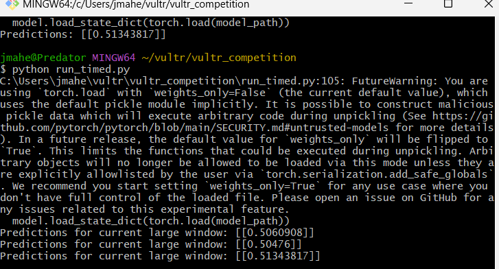

# Adjust difficuly based on eeg data

Here we use SAM40 Dataset to collect eeg data in response to various cognitive exercises.

Using this data we train a model which outputs the stress score while performing the exercises based on eeg data.

For our solution to work we need real time data while a user performs the cognitive exercises. However since we do not have access to hardware that can measure the eeg data, we rely on pre-recorded openly available datasets.

To simulate how this would happen in a real time scenario, we combine multiple trials of the experiment, for an individual, into one. Now we divide this one trial into windows of data as if looking at a data corresponding to a small duration of time compared to the total experiment duration.

