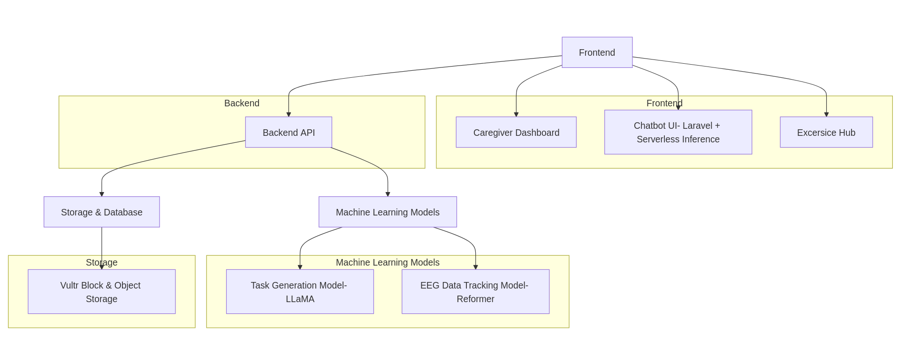
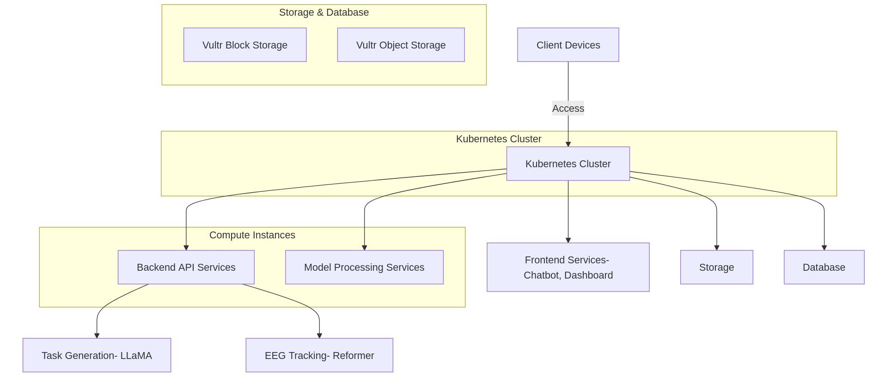
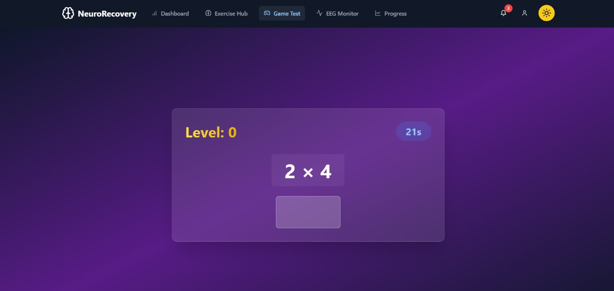
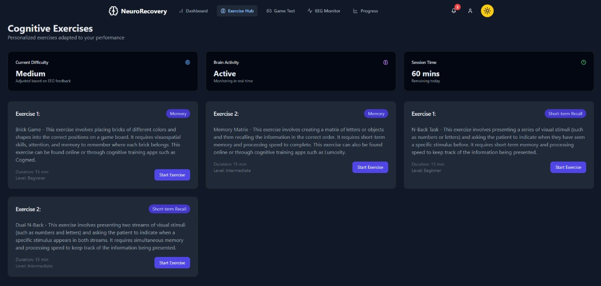
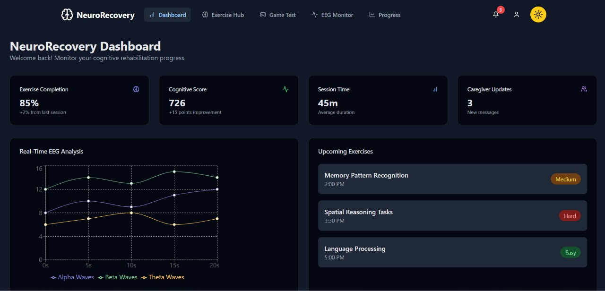
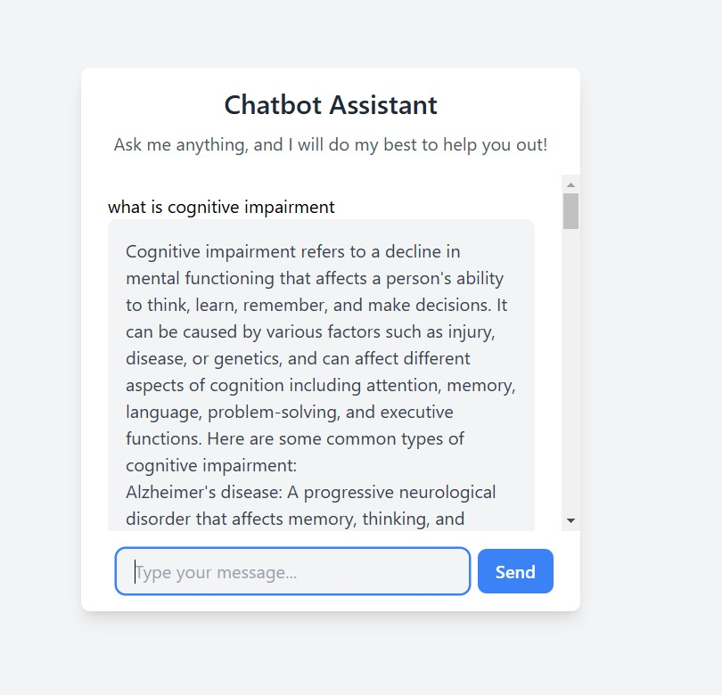

# NeuroRecovery: AI-Powered Cognitive Rehabilitation Platform

NeuroRecovery is a cloud-based, AI-driven platform designed to provide personalized cognitive rehabilitation to patients recovering from neurological disorders. The platform leverages EEG data for real-time adaptive difficulty, predictive analytics for progress tracking, and a conversational chatbot interface for patient engagement. Built on Vultr’s scalable infrastructure, NeuroRecovery allows patients to access cognitive rehabilitation from home while caregivers receive insightful, real-time updates.

## Table of Contents

- [Project Overview](#project-overview)
- [Approach](#approach)
- [Architecture](#architecture)
- [Key Features](#key-features)
- [Technical Documentation](#technical-documentation)
- [API Documentation](#api-documentation)
- [Setup](#setup)
- [Expected Outcomes](#expected-outcomes)
- [Acknowledgement](#acknowledgement)
- [Team Members](#team-members)


---

## Project Overview

NeuroRecovery aims to make cognitive rehabilitation accessible remotely, enabling patients to perform exercises from home while caregivers and therapists can monitor their progress and adjust treatment plans in real-time. The platform uses Vultr’s scalable infrastructure, a machine learning-driven task generator, and adaptive EEG-based tracking to personalize each patient’s rehabilitation journey.

## Approach

1. **Personalized Cognitive Exercises**: AI-powered task generation tailored to the patient’s recovery requirements.
2. **Real-Time Adaptive Tracking**: Integration with EEG data to adjust the difficulty level of tasks based on the patient’s cognitive load.
3. **Remote Caregiver Insights**: Predictive analytics and progress tracking for real-time monitoring of the patient’s progress by caregivers and therapists.
4. **Interactive Chatbot Interface**: A Laravel-based conversational interface for seamless patient interaction, addressing queries related to cognitive analysis, exercises, and platform features.
5. **Scalable Infrastructure**: Deployed on Vultr  Engine with monitoring for resource efficiency and resilience.

## Architecture

### High-Level Architecture
The platform is divided into five main layers:
- **Frontend**: Caregiver dashboard and chatbot UI.
- **Backend API**: Manages task requests, EEG data processing, and backend functionalities.
- **Machine Learning Models**: Task generation model (LLaMA 2) and adaptive tracking model (Reformer).
- **Storage & Database**: Vultr Block and Object Storage for patient records, logs, and datasets.
- **Cloud Infrastructure & Monitoring**: Uses Vultr Kubernetes and Prometheus for real-time monitoring and scalability.



### Network Topology
The NeuroRecovery platform is deployed and interconnected on Vultr’s cloud infrastructure:
- **Kubernetes Cluster**: Hosts API, machine learning models, and dashboards.
- **Storage**: Vultr Block Storage for logs and Object Storage for datasets.
- **Compute Instances**: Manages data processing and API requests for real-time interaction.
- **Monitoring**: Prometheus monitors resources across nodes, ensuring scalability and reliability.



## Key Features

1. **Personalized Exercise Generator**:
   - **Model**: LLaMA 2 
   - **Functionality**: Generates cognitive tasks tailored to patient profiles, aligning with cognitive exercise requirements from CogAtlas. Due to the lack of GPU access, we were unable to fine-tune the model and had to rely solely on prompt engineering to generate cognitive tasks tailored to patient profiles. These tasks were designed using **Vultr’s serverless inference** model of LLaMA 2.
   



2. **Caregiver Dashboard with Forecasting Capabilities**:
   - **Functionality**: Provides real-time insights and predictive analytics for caregivers, enabling them to track and adjust therapy plans.



3. **Real-Time Adaptive Cognitive Tracking**:
   - **Model**: Reformer architecture, integrated with Emotiv EEG data.
   - **Functionality**: Analyzes cognitive response to dynamically adjust task difficulty based on real-time EEG metrics.


4. **Laravel-based Chatbot UI for User Interaction**:
   - **Functionality**: Allows conversational interactions, guided task recommendations, and caregiver queries, enhancing patient accessibility and usability.


5. **Scalable Cloud Deployment and Monitoring**:
   - **Infrastructure**: Vultr Kubernetes Engine (VKE) for real-time performance monitoring and resource scaling.

## Technical Documentation

### System Architecture and Design

NeuroRecovery’s architecture integrates multiple technologies:
- **Frontend**: Built on Laravel with Serverless Inference for real-time conversational AI.
- **Backend API**: Python-based, manages request processing and machine learning workflows.
- **Task Generation Module**:
   - **Model**: LLaMA 2 (integrated via Vultr Serverless Inference API)
   - **Functionality**: Generates cognitive tasks based on patient data.
- **EEG Data Processing Module**:
   - **Model**: Reformer architecture with Emotiv EEG data integration.
   - **Functionality**: Adjusts task difficulty in real-time based on EEG input.
- **Monitoring Module**:
   - **Infrastructure**: Vultr 
   - **Functionality**: Monitors CPU, memory usage, and app performance in real-time.

## API Documentation

### Endpoints

- **`/generate-exercise`**
  - **Description**: Requests a new cognitive exercise for a patient.
  - **Parameters**: `cognitive_level`, `task_type`
  - **Response**: JSON containing task details and adaptive metrics.

- **`/submit-eeg-data`**
  - **Description**: Submits real-time EEG data for task difficulty adjustment.
  - **Parameters**:  `eeg_signal_data`, `session_id`
  - **Response**: Confirmation of data processing and difficulty adjustment.

- **`/get-progress`**
  - **Description**: Fetches cognitive progress and forecast for a patient.
  - **Parameters**: `patient_id`
  - **Response**: JSON with progress metrics and predicted trend.
 
- **`/get-scores`**
  - **Description**: Fetches eeg data and corresponding score.
  - **Parameters**: `patient_id`
  - **Response**:Stress score corresponding to the patient id.

## Setup 

### Project Setup Guide

### Backend Setup

1. **Navigate to the backend directory:**
   ```bash
   cd backend
2. **Install the required dependencies:**
   ```bash
   npm install

3. **Set up the .env file:**
   ```bash
   Copy the contents of the env-example file into a new .env file.
   Modify the values in .env as needed to match your environment.

4. **Start the backend server:**

   ```bash
   node server.js

### Frontend Setup
1. **Navigate to the frontend directory:**
   ```bash
   cd frontend
2. **Install the required dependencies:**
   ```bash
   npm install
   
3. **Run the frontend development server:**
   ```bash
   npm run dev

## Expected Outcomes

- **Remote Cognitive Rehabilitation**: Patients can perform cognitive exercises from home, tailored to their unique needs.
- **Real-Time Adaptive Therapy**: Adjusts task difficulty in real-time based on EEG data to ensure optimal cognitive load and engagement.
- **Caregiver Insights**: Provides real-time progress and predictive insights to caregivers and therapists.
- **Scalable and Resilient**: Leverages Vultr’s infrastructure for high availability, security, and scalability.
- **User-Friendly Conversational Interface**: Enhances patient engagement through a Laravel-based chatbot with Serverless Inference.

## Acknowledgement
This project was developed as part of the **Vultr Cloud Innovate Hackathon**. We extend our gratitude to Vultr for providing the platform and resources that made this project possible.

## Team Members

- **Soham Mulye** 
- **Anuj Vaid**
- **Om Doiphode**
- **Dhruvanshu Joshi**

## Conclusion

NeuroRecovery leverages AI-driven cognitive exercises, real-time EEG tracking, and scalable cloud infrastructure to provide personalized cognitive rehabilitation. With adaptive therapy, predictive insights for caregivers, and a user-friendly chatbot interface, NeuroRecovery aims to bring effective cognitive therapy into the home, supporting patients, caregivers, and healthcare providers in improving patient outcomes.
